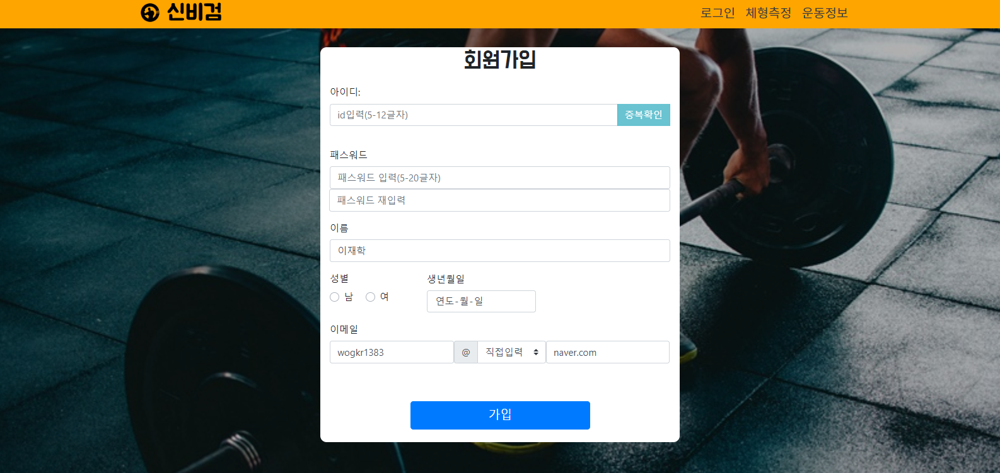
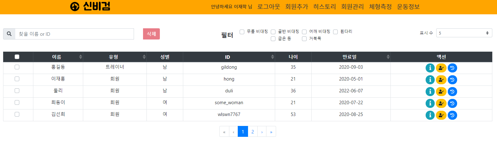
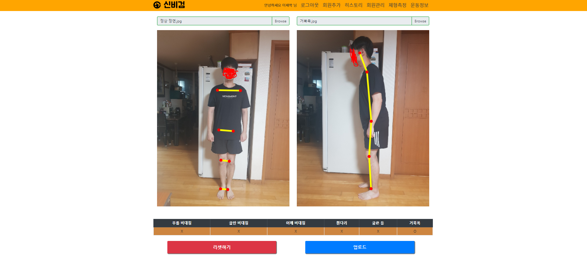
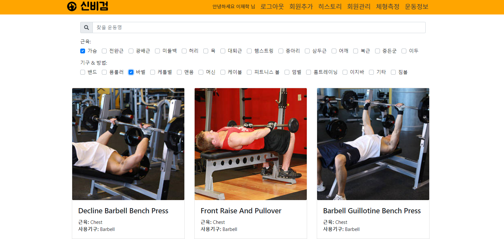

# 비대칭 신체 판별 웹

  

본 웹은 **SPA로 구성한 웹**으로 헬스장을 대상으로 만들었으며 [posenet](https://medium.com/tensorflow/real-time-human-pose-estimation-in-the-browser-with-tensorflow-js-7dd0bc881cd5)을 이용하여 사용자의 신체의 비대칭을 측정합니다.  

- **기능과 기능, 특징**
  - [로그인](#로그인)
  - [회원추가](#회원추가)
  - [회원관리](#회원관리)
  - [체형측정](#체형측정)
  - [히스토리](#히스토리)
  - [운동정보](#운동정보)
  - [반응형](#반응형)

- **측정 가능한 비대칭 신체**
  - 무릎 비대칭
  - 골반 비대칭
  - 어깨 비대칭
  - 휜다리
  - 굽은등
  - 거북목

- **주의사항!**
  이곳의 소스코드에서 민감한 개인정보(구글 아이디 등)은 공백 및 주석처리 하였습니다.  
  이 소스코드의 원본은 제 private repo의 원본에 있습니다. 따라서, 이 소스코드로는 웹이 동작하지 않습니다.  
  아래 웹사이트 주소로 접속해주시기 바랍니다.

- **웹사이트 주소**: [https://mybodycheck.herokuapp.com/](https://mybodycheck.herokuapp.com/)

- **사용된 대표적인 기술 및 패키지**
1. **프론트 엔드**
    - Vue.js
    - BootstrapVue
    - Tensorflow.js(tensorflow-models/posenet 패키지)
2. **백엔드**
    - Node.js(10.15.2)
    - Express.js
    - nodemailer
    - MongoDB
3. **기타**
    - python 크롤링을 위한 BeautifulSoup 패키지

## 로그인

 

**세션을 체크하기 때문에 브라우저를 종료하지 않은 이상 로그인된 회원은 다시 로그인된 상태로 접속**할 수 있습니다.  
로그인은 2가지 사용자가 **관장, 트레이너** 혹은 **회원** 등급인지에 따라서  이용할 수 있는 서비스가 달라집니다.

- **관장, 트레이너 등급** : 전체 기능 이용 가능
- **회원 등급** : 로그아웃, 히스토리, 체형측정, 운동정보

## 회원추가

  

위는 추가할 회원의 회원가입 요청을 보내는 화면입니다.  
이 화면에서 조작 버튼을 누르면 비대칭 검사, 회원가입 요청 삭제를 할 수 있습니다.  
입력창에 해당하는 정보를 입력하면 이메일 주소로 회원 가입 링크가 발송이 됩니다.  
이때 이미 가입된 이메일 주소와 중복된 경우 경고 메시지를 날립니다.

 

 

## 회원관리

 

회원관리를 하는 창으로 회원을 찾거나 필터를 통해 원하는 회원을 검색할 수 있습니다.  
회원관리 테이블의 액션은 해당하는 회원에 대해서 좌측에서 우측 순은 버튼으로 회원 상세정보 확인 및 수정, 체형측정(비대칭 체형 측정), 히스토리(자신의 몸 변화를 볼 수 있음)를 볼 수 있습니다.

(이때 이 테이블의 액션 버튼을 통해 사용자의 비대칭을 측정해야 해당 사용자를 저장할 수 있습니다.  만약 메뉴를 통해 체형측정을 누른 경우 체형측정을 할 수 있되 저장은 할 수 없습니다.)

## 체형측정

 

체형측정을 하는 페이지로 체형측정을 위해 "**Browse**" 버튼을 입력하여 좌측에는 정면사진, 우측에는 측면사진을 입력합니다.  
사진 입력 후 "**신체 분석**" 버튼을 누르면 아래와 같이 관절 위치와 비대칭 결과가 나타납니다.

 

분석이 완료된 결과는 "**업로드**" 버튼을 통해 서버에 업로드를 할 수 있습니다.
또한, "**리셋하기**" 버튼으로 다시 사진을 입력하여 신체분석을 재진행 할 수 있습니다.

비대칭 신체 분석 기능을 구현하기 위해 **tensorflow-models/posenet 패키지**를 이용하여 각 관절의 위치를 구한후 각 관절을 위의 사진과 이었을 때 특정 각도 그리고 서로 평행되는지를 확인하여 비대칭을 판별합니다.

## 히스토리

이 페이지는 사용자가 업로드한 비대칭 결과들을 비교 확인할 수 있는 페이지입니다.  
"**비교1 사진 입력**", "**비교2 사진 입력**" 버튼을 누르면 아래와 같이 자신이 업로드 했었던 결과 및 사진을 볼 수 있습니다.

 

 

## 운동정보

 

운동 정보를 검색할 수 있는 곳으로 운동이되는 근육과 기구, 방법에 대해서 필터링 및 검색을 할 수 있습니다.  
이 페이지의 사진과 정보들은 **python과 BeautifulSoup 패키지를 이용하여 크롤링**하였습니다.  
"자세한 운동법"을 클릭한 경우 크롤링한 페이지로 이동하게 됩니다.(그곳에서 운동에 대한 정확한 정보를 얻을 수 있습니다.)

## 반응형

마지막으로 본 웹은 테블릿pc, 휴대폰에서도 작동할 수 있게 반응형으로 작동합니다.

